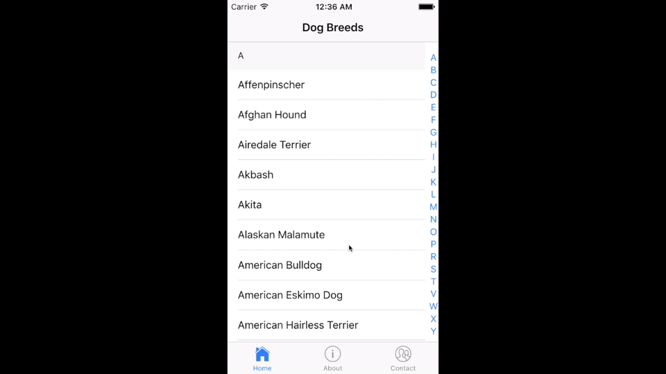

# ionic2-alpha-scroll
Configurable Ionic 2 component for alphabetically indexed list with an alpha scroll bar.  This component has a few improvements on the original Ionic 1 component, mainly the panning functionality on the alpha wheel scroll shown below in the demo.

## Installation

1. Use npm to install the component

    ```bash
    npm install ionic2-alpha-scroll --save
    ```

2. Import the ionic2-alpha-scroll component for your page and add it to your page's directives.

    ```javascript
    import { IonAlphaScroll } from 'ionic2-alpha-scroll';

    @Component({
      templateUrl: 'build/pages/alpha-list/alpha-list.html',
      directives: [IonAlphaScroll]
    })
    export class AlphaListPage { }
    ```

## Demo
[Here is a sample Ionic 2 app on GitHub that shows how to use this component](https://github.com/rossmartin/ionic2-alpha-scroll-example)


## Usage

To use the `ion-alpha-scroll` component add this below to the `<ion-content>` in your template:
```html
<ion-alpha-scroll *ngIf="breeds"
  [listData]="breeds"
  key="name"
  [itemTemplate]="alphaScrollItemTemplate"
  [currentPageClass]="currentPageClass"
  [triggerChange]="triggerAlphaScrollChange">
</ion-alpha-scroll>
```

* `listData` is the model you would like to sort. Use an array of objects here.
* `key` is the name of the key you would like to sort by.
* `itemTemplate` is the template to display for the properties of each item in the model.
* `currentPageClass` is a reference to the instance of the current current page class (see example below).  This is needed so that bindings on the `itemTemplate` can refer to the Ionic 2 page class containing the `ion-alpha-scroll`.
* `triggerChange` can be any property you want that can be changed to trigger `ngOnChange` for the `ion-alpha-scroll` component.  If `listData` was modified the alpha list will reflect that after triggering the change.

Heres a quick example:

```javascript
import { IonAlphaScroll } from 'ionic2-alpha-scroll';


@Component({
  template: `
    <ion-header>
      <ion-navbar>
        <ion-title>Dog Breeds</ion-title>
      </ion-navbar>
    </ion-header>

    <ion-content class="alpha-list-page">
      <ion-alpha-scroll *ngIf="breeds"
        [listData]="breeds"
        key="name"
        [itemTemplate]="alphaScrollItemTemplate"
        [currentPageClass]="currentPageClass"
        [triggerChange]="triggerAlphaScrollChange">
      </ion-alpha-scroll>
    </ion-content>
  `,
  directives: [IonAlphaScroll]
})
export class AlphaListPage {
  breeds: any;
  currentPageClass = this;
  alphaScrollItemTemplate: string = `
    <div (click)="currentPageClass.onItemClick(item)">
      {{item.name}}
    </div>
  `;
  triggerAlphaScrollChange: number = 0;

  constructor() {
    this.assignBreeds();
  }

  onItemClick(item) {
    // This is an example of how you could manually trigger ngOnChange
    // for the component. If you modify "listData" it won't perform
    // an ngOnChange, you will have to trigger manually to refresh the component.
    this.triggerAlphaScrollChange++;
  }

  assignBreeds() {
    this.breeds = [
      {
        'name': 'Affenpinscher'
      },
      {
        'name': 'Afghan Hound'
      },
      // ...
    ];
  }

  // ...
}
```

If you would like to disable the scroll bar for the `ion-alpha-scroll` `scroll-content` use this CSS:

```css
.ion-alpha-scroll scroll-content::-webkit-scrollbar {
  display: none;
}
```

## Acknowledgements

[https://github.com/aquint/ion-alpha-scroll](https://github.com/aquint/ion-alpha-scroll)

## License

[MIT](LICENSE)
